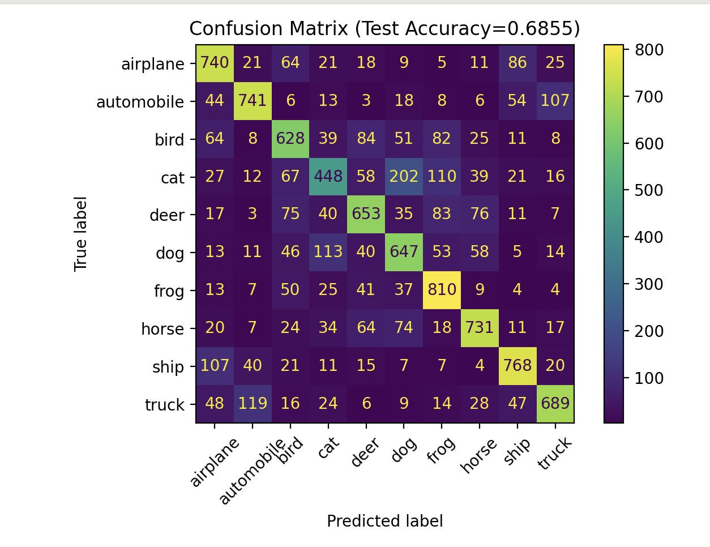
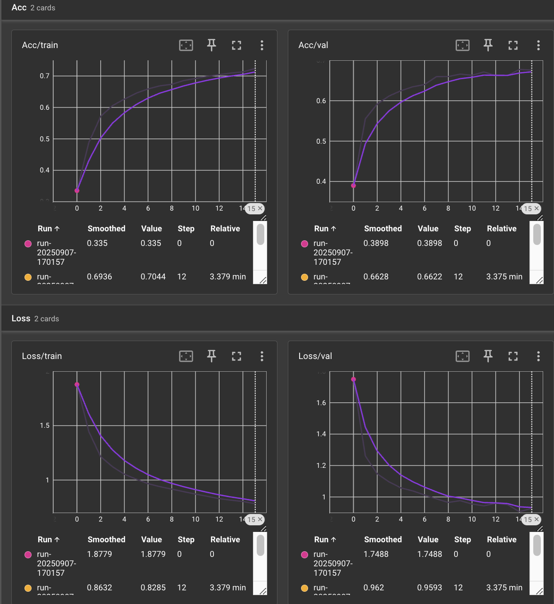
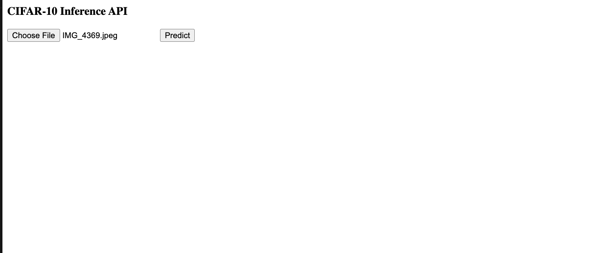
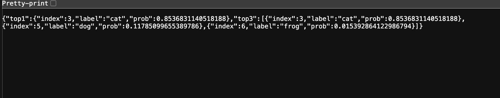
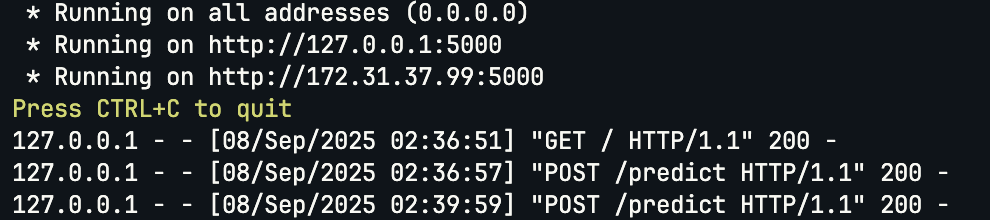
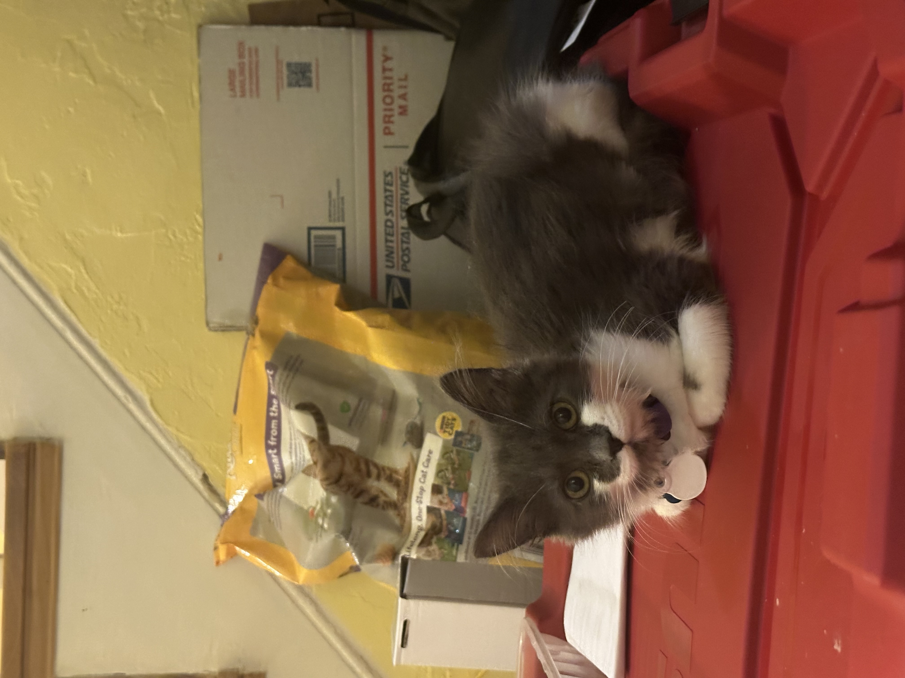

# ResNet18 Fine-Tuning on CIFAR-10 + Flask Inference API

This project demonstrates how to fine-tune a pre-trained ResNet18 model on the CIFAR-10 dataset using PyTorch, and deploy the trained model as a REST API using Flask.  

The workflow includes:
- Two-phase training (warm-up + fine-tuning)  
- TensorBoard visualization and evaluation with confusion matrix  
- Flask-based inference API (with `/health` and `/predict` endpoints)  
- Deployment on AWS EC2 (tested on Ubuntu 22.04 + Python 3.10)

---

## Installation

Clone this repository and install dependencies:

```bash
git clone https://github.com/hortus-neu/cifar10-resnet--flask-inference.git
cd cifar10-resnet--flask-inference

# Create a conda environment
conda create -n cifar10 python=3.9 -y
conda activate cifar10

# Install dependencies
pip install -r requirements.txt
```

Requirements:
- Python ≥ 3.8
- PyTorch ≥ 2.0
- torchvision
- scikit-learn
- matplotlib
- tensorboard
- flask
- pillow

## Training
Run training with:
```
python src/train.py
```
The training has two phases:
  1. Warm-up: freeze backbone, only train the last FC
  2. layer.Fine-tuning: unfreeze `layer4 + fc`, train with smaller learning rate.
      - TensorBoard logs will be saved in `logs/`.
      - Best weights will be saved in `weights/resnet18_finetune_best.pt`.

## Example Training Log:
```
[Fine 10] train_loss=0.8703 acc=0.6922 | val_loss=0.9546 acc=0.6630
✅ Training finished! Best val_acc=0.6774, weights saved to weights/resnet18_finetune_best.pt
✅ Test Accuracy: 0.6855
```

## Inference API (Flask)
After training, you can start the Flask server:
```
cd app
python app.py
```
The API exposes two endpoints:
- GET /health
Check service and model status.
```json
{"status": "ok", "device": "cpu", "weights": "weights/resnet18_finetune_best.pt"}
```
- POST /predict
Upload an image via form-data (`field=image`). Returns top-1 and top-3 predictions.
Example request:
```bash
curl -X POST http://<EC2_PUBLIC_IP>:5000/predict \
  -F "image=@test_images/cat.jpg"
```
Example response:
```
{
  "top1": {"index": 3, "label": "cat", "prob": 0.85},
  "top3": [
    {"index": 3, "label": "cat", "prob": 0.85},
    {"index": 5, "label": "dog", "prob": 0.11},
    {"index": 6, "label": "frog", "prob": 0.01}
  ]
}
```
## Repository Structure
```bash
.
├── app/
│   └── app.py               # Flask inference API
├── src/
│   └── train.py             # main training script
├── weights/                 # saved checkpoints (ignored in git)
├── logs/                    # TensorBoard logs (ignored in git)
├── results/                 
│   ├── confusion_matrix.png
│   ├── training_curves.png
│   ├── inference_demo.png
│   └── flask_logs.png
├── test_images/             # sample images for inference
├── requirements.txt         # dependencies
├── README.md                # documentation
└── LICENSE                  # open-source license
```

## Results

### Test Accuracy
Achieved **68.55%** accuracy on CIFAR-10 test set.

### Confusion Matrix


### Training Curves
Accuracy and loss curves from TensorBoard:


### Inference Demo
A test image uploaded via the Flask API (`/predict`) returned the following:



### Flask Logs
Server logs showing inference requests:



## Citation
If you use this repo in your work, please cite:

```bibtex
@misc{he2025resnet18cifar10,
  author       = {Tao He},
  title        = {ResNet18 Fine-Tuning on CIFAR-10 + Flask Inference API},
  year         = {2025},
  howpublished = {\url{https://github.com/hortus-neu/cifar10-resnet--flask-inference}},
}
```

## License
This project is released under the MIT License.
See [LICENSE](LICENSE) for details.

## TBC
1. Dockerize the Flask API for reproducible deployment
2. Extend experiments to other datasets (e.g., CIFAR-100, Tiny-ImageNet)
3. Try advanced schedulers or optimizers

## Acknowledgment
Thanks to Cloud, for keeping me company during this project and making me laugh🐾.
